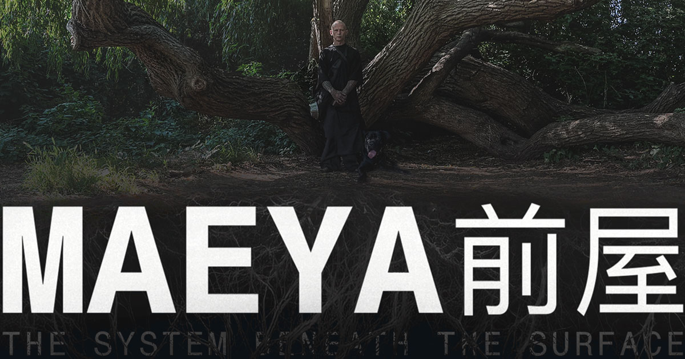

<p align="center">
  
</p>

## A living human–AI system for continuity, evidence, pattern recognition and navigating fragmented systems.

Maeya started because I was trying to understand what kept happening: following memories, making connections, mapping events, writing, making art and looking for the patterns underneath what I was experiencing. I'd spent years searching for answers but kept reaching the same points of collapse. I began using AI to reconstruct timelines, compare events, organise evidence, follow threads and question recurring patterns, turning my life into data. This process became **Behavioural Loop Mapping**. A model that surfaced something I had missed my whole life: I was masking autism, ADHD and CPTSD. I then started applying it across different parts of my life, forming a system.

## What it does

Maeya is live infrastructure. I use it across my home, health, finances, legal matters, public services, evidence, daily functioning and the technical system itself. The stakes are real because the consequences are real. It's being built as it solves several connected systems at once that share one problem: fragmentation.

The system is being used while it's being built, its development is failure-driven. None of the results are abstract. It's a high-stakes feedback-loop environment: when something fails, the consequence is lived; when something works, it becomes part of the next iteration. The aim is to make the system reliable enough to support the life it already sits inside, understand why parts of it work and make any useful mechanisms accessible to others.

## Neurodivergence, trauma and the architecture

Autism, ADHD and trauma have shaped how I work and how the system work.

Context loss, working memory, sequencing, hyperfocus, overload, task switching, burnout and repeated administrative work all have consequences. The system gradually picked up things like persistent context, provenance, evidence linked to source, recoverable workflows, reduced repetition, clear task state and continuity across sessions.

**I did not begin with an architecture and then apply it to my life.** I built this because I needed it, used it, found where it failed, changed it and kept going.

## The reverse-engineer

I'm trying to work out what actually happened in this Human+AI collaboration. What came from me? What came from the AI? What worked? What was just interpretation? What had to be corrected repeatedly? What needs to exist outside the model for the system to stay reliable?

Through the work I've discovered others already working on many of the same problems: extended cognition, agents, memory, provenance, accessibility, local AI, human–AI collaboration and governance. What interests me is how they connect through actual use in one living system, across different parts of one life, while the system actually has to work.

## Local system build

This didn't start with the aim to engineer the whole system myself, I simply couldn't find anyone I knew with the **time** or **capacity** to build it with me, and the need didn't go away.

The local build is about greater control over continuity, privacy, behaviour and the data the system depends on. Understanding how tools like this can help others manage administration while making themselves more visible to healthcare, legal, administrative and public systems that routinely fragment their lives.

Doing this has changed how I see AI. I used to focus on what work it might replace. Now I'm more interested in how it can help us do the things that are important to us, taking over the jobs consuming human time and capacity. 

**Better tools. More control over our own data. Systems that work for the people they're meant to support. And giving back the one thing we all wish we had more of... TIME.**

## What this repository is

`maeya-system` is the reusable technical layer of Maeya.

It contains material that can be inspected, tested, changed and rolled back independently:

- agent definitions;
- skills;
- schemas;
- workflow logic;
- tools;
- tests;
- archive-analysis tooling;
- technical documentation;
- operational workflows.

The private longitudinal source record — case evidence, personal material, canonical archives — lives separately in `maeya-second-brain`. That separation matters.

```text
Sources   = what came in
Artefacts = what Maeya produced from it
System    = reusable technical infrastructure
```

## Repository structure

```text
maeya-system/
├── Agents/           — agent definitions and profiles
├── Artefacts/        — what Maeya produced from sources
├── Operations/       — operational workflows
├── Shared/           — shared config and resources
├── Wiki/             — documentation
├── document-system/  — document production tools
├── documentation/    — technical docs
├── openai-archive-tools/ — archive analysis
├── patches/          — patches and migrations
├── schemas/          — data schemas
├── scripts/          — executable scripts
├── skills/           — reusable agent capabilities
├── tests/            — verification and regression tests
├── tools/            — technical tooling
├── AGENTS.md         — machine/project instruction contract
├── SCHEMA.md         — repository schema
└── RUNTIME_BOUNDARY.md — technical/private boundary
```

## For engineers

Start here:

- [`AGENTS.md`](AGENTS.md) — machine/project instruction contract
- [`SCHEMA.md`](SCHEMA.md) — repository schema
- [`RUNTIME_BOUNDARY.md`](RUNTIME_BOUNDARY.md) — technical/private boundary
- [`skills/`](skills/) — reusable agent capabilities
- [`tests/`](tests/) — verification and regression tests

When proposing a change, prefer a small, reversible patch with an explicit test over a broad architectural rewrite.

## For contributors

Contributions that improve inspectability, reliability, provenance, testing, accessibility, and reproducibility are particularly useful.

Before opening a pull request:

1. read `AGENTS.md`, `SCHEMA.md`, and `RUNTIME_BOUNDARY.md`;
2. identify the exact problem being changed;
3. preserve source / artefact / system boundaries;
4. avoid destructive cleanup where a reversible migration is possible;
5. add or update tests where behaviour changes;
6. report what was actually verified.

Please avoid introducing clinical, legal, causal, or scientific claims that are not supported by evidence.

---

> Maeya is being built while it is being used.
> The development record therefore contains working systems, failed systems, corrections, unresolved questions, and the human circumstances that made continuity necessary in the first place.
